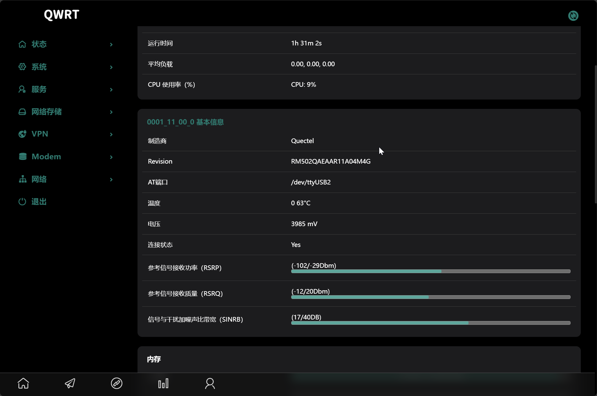
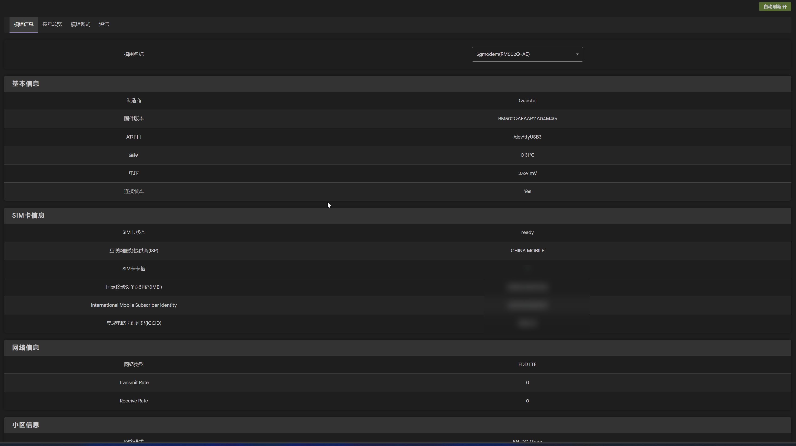
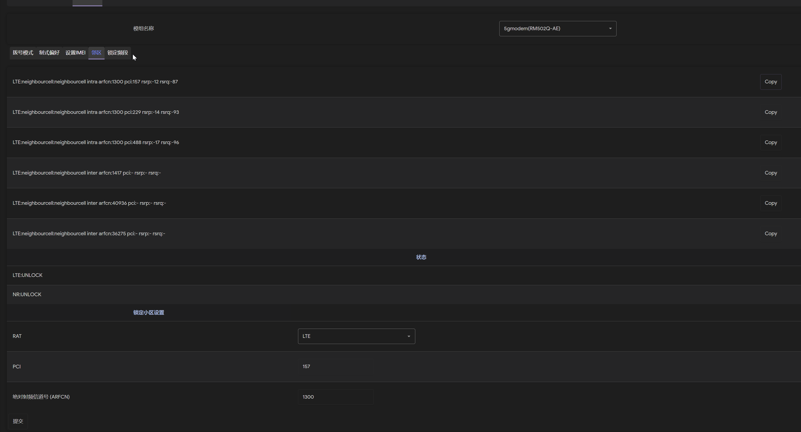
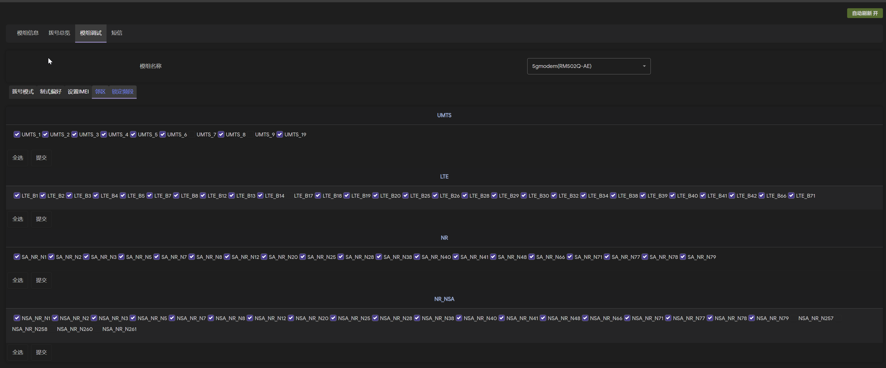
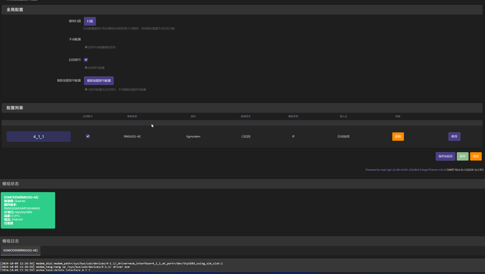
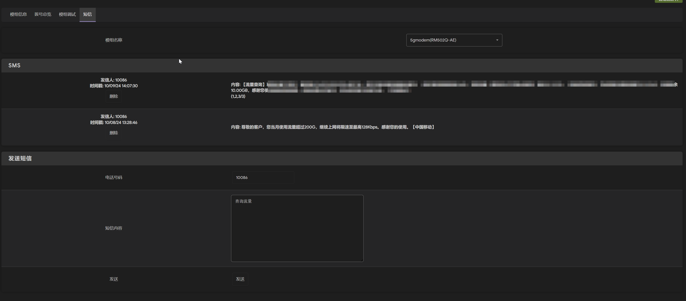

# QModem

QModem is a module management plugin compatible with OpenWRT version 21 and later. Developed in Lua, it is compatible with QWRT/LEDE/Immortalwrt/OpenWRT.

(For js luci, please add the luci-compat package.)

[TOC]

# Quick Start

## Add Feed Source

To use QModem, you first need to add a feed source in OpenWRT:

```shell
echo >> feeds.conf.default
echo 'src-git modem https://github.com/FUjr/modem_feeds.git;main' >> feeds.conf.default
./scripts/feeds update modem
./scripts/feeds install -a -p modem
```

## Integrate Packages

Run the following command in the terminal to open the configuration menu:

```shell
make menuconfig
```

## Select and Install Packages

In the configuration menu, you can select the following packages (all under Luci/Application):

| Package Name                          | Functionality                             |
| ------------------------------------- | :---------------------------------------: |
| **luci-app-qmodem**                   | Provides module info, dialing settings, and advanced settings. Other features depend on this main program (backend included here). |
| **Add Lua Luci Homepage**             | Adds Lua Luci homepage. If using luci2 (Js Luci) and selected, there will be two homepages. |
| **Add PCIe Modem SUPPORT**            | Select PCIe driver, requires kmod_mhi in feeds. |
| **Using Tom customized Quectel CM**   | Uses a customized Quectel CM from this repo, supporting options like blocking default route addition and resolv.conf modification (choose one). |
| **Using QWRT quectel-CM-5G**          | Uses QWRT's quectel-CM-5G (choose one).   |
| **Using Normal quectel-cm**           | Uses the standard quectel-cm (choose one).|
| **luci-app-qmodem-hc**                | Supports hc-g80 SIM card switching, exclusive to specific devices. |
| **luci-app-qmodem-mwan**              | Supports multi-WAN settings.              |
| **luci-app-qmodem-sms**               | SMS sending feature.                      |
| **luci-app-qmodem-ttl**               | TTL rewrite functionality.                |

# Project Introduction

## Why Choose This Project

- **Stability**: Improved system stability by caching and reducing AT command frequency.
- **Extensibility**: Minimal API endpoints and unified backend design for easy development and expansion.
- **Reliability**: Function separation ensures core functionality remains stable even if other features have issues.
- **Multi-Module Support**: Modules and configurations are uniquely bound to slots, preventing confusion during reboots or hot-swapping.
- **SMS Support**: Long SMS merging and Chinese SMS sending.
- **Multi-Language Support**: Language resources separated for easy addition of new languages.
- **IPv6 Support**: Partial IPv6 support under specific conditions (e.g., China Mobile card, rm50xq qmi/rmnet/mbim driver, using quectel-CM-M for dialing, extended prefix mode).
- **Optimized Quectel-CM**: Improved version of Quectel-CM with options to prevent overwriting resolv.conf and default routes.
- **[Newly Implemented AT Tool](docs/tom_modem.cn.md)**: Combines features from sendat, sms_tool, and gl_modem_at into a single tool for AT command handling.

## Module Information





## Advanced Module Settings

Configure dialing mode, network preferences, IMEI settings, cell locking, frequency locking, etc.





## Dialing Overview



### Global Configuration

Provides global configuration options for unified module settings.

- **Reload Dialing**: Reloads the module configuration file to ensure settings take effect.
- **Dialing Master Switch**: Enables dialing when switched on.

### Configuration List

- Slot ID associates modules with configuration files to prevent confusion during changes.
- Dialing-related settings require a redial to take effect.
- Network interface name is the module alias; if left blank, it defaults to the slot ID.

## SMS



## Mwan Configuration

This page is the **MWAN Configuration** interface, helping users manage multiple WAN connections by monitoring specific IPs to ensure network stability and reliability. Users can customize connection priorities and interfaces for load balancing or failover.

| Feature             | Description                                                        |
|---------------------|--------------------------------------------------------------------|
| **Enable MWAN**     |                                                                    |
| Same Source Address | Ensures traffic from the same source uses the same WAN port for a set time. |
| **IPv4 Configuration** |                                                                |
| Interface           | Select WAN interfaces (e.g., `wan`, `usb0`) for different network connections. |
| Tracking IP         | Enter specific IP addresses or domain names to monitor.            |
| Priority            | Set connection priority (1 to 255); lower values mean higher priority. |

## QModem Settings

| Configuration                | Description                                                        |
|------------------------------|--------------------------------------------------------------------|
| **Disable Auto-Load/Remove** | Disables all features below.                                       |
| **Enable PCIe Module Scan**  | Scans PCIe interfaces at startup (time-consuming).                 |
| **Enable USB Module Scan**   | Scans USB interfaces at startup (time-consuming).                  |
| **Monitor Configured USB Ports** | Monitors USB hot-plug events for configured slots.            |
| **Monitor Configured PCIe Ports** | Scans PCIe ports at startup for configured slots.            |

### Slot Configuration

This page allows users to configure each slot.

| Configuration                  | Description                                                        |
|-------------------------------|--------------------------------------------------------------------|
| **Slot Type**                 | Choose the slot type (PCIe/USB) for device identification.         |
| **Slot ID**                   | Enter the device's unique identifier (e.g., `0001:11:00.0[pcie]`). |
| **SIM Card Indicator**        | Bind slot to corresponding indicator light for SIM card status.    |
| **Network Indicator**         | Bind slot to network status indicator for monitoring connection status. |
| **Enable 5G to Ethernet**     | Enables communication via network interface for supported modules. |
| **Associated USB**            | Associates USB ports with PCIe ports for better AT communication compatibility. |

## Development Plan

| Plan                                      | Progress             |
|-------------------------------------------|----------------------|
| Separate backend from luci-app completely | 0%                   |
| Switch to js luci                         | 5%                   |

# Acknowledgments

During the development of the module management plugin, the following repositories were referenced:

| Project                                    | Reference Content                       |
|--------------------------------------------|-----------------------------------------|
| https://github.com/Siriling/5G-Modem-Support | Module list and some AT implementations |
| https://github.com/fujr/luci-app-4gmodem     | Adopted many ideas from this project    |
| https://github.com/obsy/sms_tool             | AT command sending tool                 |
| https://github.com/gl-inet/gl-modem-at       | AT command sending tool                 |
| https://github.com/ouyangzq/sendat           | AT command sending tool                 |
